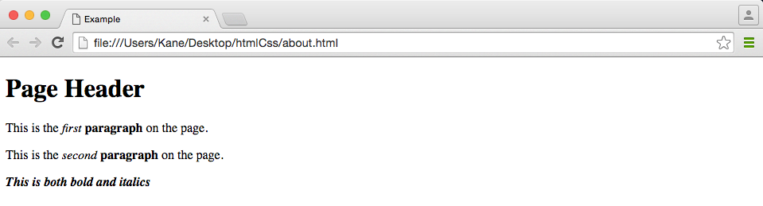

# Introduction to HyperText Markup Language (HTML)

## History
HTML was developed by Tim Berners-Lee in the pre-world wide web days of the 90s. Berners-Lee was working with CERN and believed that his fellow scientists would benefit from a way to share research with one another over the internet, and so HTML was born. HTML is a language simple enough to be used by anyone, but also dynamic enough to have survived for over 20 years.  

## Learning Objectives
* Understand how HTML is used to provide formatting to text, and give structure to web pages.
* Use HTML to format a basic web page.

## Create a HTML document
First, create a folder named 'website' on the desktop of your computer.  
  
Open a text editor, this could be Notepad, textEdit, Notepad++, or Sublime Text, whatever you have on your computer.  
  
(If you are on a mac, and using textEdit, be sure to make it plain text by selecting 'Format > Make Plain Text')
  
Create a new file an save it as 'index.html' inside of the 'website' folder on your desktop.  
  
Back in your text editor, enter the following code:  
  
```html
<!doctype html>
<html>
  <head>
  </head>
  <body>
    <h1>Hello World</h1>
  </body>
</html>
```  
  
Now save your file. Open Finder (mac), or File Explorer (Windows) and open your 'index.html' file in a browser by right clicking on the file, and choosing to open with 'Safari', 'Chrome' or which ever browser you prefer.  
  
You should see the following:  
  
  
  
This is a convention in programming known as 'Hello World'. It is the most basic step in any application to ensure that our configuration is working.  
  

  
## Understanding Elements
An HTML element, or tag, is defined by some number of characters contained within an opening and closing angle bracket: 
  
###```<p> </p>```
The `<p>` or 'paragraph' tag above demonstrates the essential syntax of HTML involving an opening tag and a closing tag. Not all HTML requires a closing tag, but in the case of paragraph, it does.  
  
Let's look back at the basic HTML skeleton we created above.  
  
```html
<!doctype html>
<html>
  <head>
  </head>
  <body>
    <h1>Hello World</h1>
  </body>
</html>
```

* The ```<!doctype html>``` element is a declaration that tells the browser rending our HTML that the text that follows is an HTML document.
* ```<html></html>``` simply indicates that everything enclosed within it is html code.
* The ```<head></head>``` elements denote content that will not appear on our web page, but may contain additional resources, such as links to css stylesheets or javascript files, about our web page.
* ```<body></body>``` tags indicate that anything contained within them should be shown in the browser window and displayed to the user.
* Finally, the ```<h1></h1>``` is a top level header, as we've seen in the example. There are lesser sub-headers available in html as well: ```<h2>```,```<h3>```,```<h4>```...
  
Let's improve our code, and flesh out our web page with a bit more content.  
  
```html
<!doctype html>
<html>
  <head>
  	<title>Example</title>
  </head>
  <body>
    <h1>Page Header</h1>
    <p>This is the <em>first</em> <strong>paragraph</strong> on the page.</p>
    <p>This is the <em>second</em> <strong>paragraph</strong> on the page.</p>
    <p><strong><em>This is both bold and italics</em></strong></p>
  </body>
</html>
```  
  
Which will render:  
  
  
  
This example demonstrates some of the basic structure and formatting that HTML can provide us.  
  
#### `<title>`
The pair of `<title>` elements in the head are not displaying the word 'Example' in the body of the web page. Instead, the `<title>` tag is responsible for displaying the title of the page in the browser tab above:  
  
  
  
#### `<p>`
The 'paragraph' tag automatically adds spacing around the text it contains, seperating it from other content, much like a paragraph stands removed from other paragraphs in a text document.
  
#### `<em>`, `<strong>`
The `<em>` and `<strong>` elements are responsible for formatting our text as italics and bold. 
  
## Lists and Tables
More advanced presentation of content is also supported in HTML. Say you wanted to create a bulleted, or numbered list of items, this can be accomplished with relative ease.  
  
```html
<ul>
	<li>Airplane</li>
	<li>Boat</li>
	<li>Car</li>
</ul>

<ol>
	<li>Milk</li>
	<li>Eggs</li>
	<li>Bacon</li>
</ol>
```

  
  
#### Unordered Lists (`<ul>`) and Ordered Lists (`<ol>`)
Both unordered and ordered lists use similar syntax, the obvious difference being that while unordered lists are bulleted, ordered lists are numbered. Each of the lists types contains some number of 'list items' (`<li>`).  
  
If you want to make your lists even more versatile, you can make them heirarchical with multiple levels of indentation by nesting one list within another...you can even combine list types.  
  
```html
<ul>
	<li>Airplane</li>
		<ul>
			<li>F-14 Tomcat</li>
			<li>Leer Jet</li>
			<li>737</li>
		</ul>
	<li>Boat</li>
	<li>Car</li>
		<ol>
			<li>Toyota Camry</li>
			<li>Ford F-150</li>
		</ol>
</ul>

<ol>
	<li>Milk</li>
		<ul>
			<li>Skim</li>
			<li>Heavy Whipping Cream</li>
		</ul>
	<li>Eggs</li>
	<li>Bacon</li>
</ol>
```  
  

  
#### Tables
If you need to keep track of tabular data, like a spreadsheet, or taxes...There is an HTML `<table>` which can be used to form rows and columns.  
  
```html
<table>
	<tr>
		<td>Stacy</td>
		<td>Gwen</td>
		<td>GStacy@hotmail.com</td>
	</tr>
	<tr>
		<td>Wade</td>
		<td>Wilson</td>
		<td>wade.wilson@yahoo.com</td>
	</tr>
	<tr>
		<td>Scott</td>
		<td>Summers</td>
		<td>scott_summers@gmail.com</td>
	</tr>
</table>
```

  
  
Here the `<table>` defines the beginning and end of the table, the `<tr>` begins each row, and the `<td>` represents the data in each table cell.  
  
This table isn't particularly descriptive at the moment as we haven't provided any table headers, luckily, HTML provides us with elements to do just that.  
  
```html
<table>
	<thead>
		<tr>
			<th>First Name</th>
			<th>Last Name</th>
			<th>Email</th>
		</tr>
	</thead>
	<tbody>
		<tr>
			<td>Stacy</td>
			<td>Gwen</td>
			<td>GStacy@hotmail.com</td>
		</tr>
		<tr>
			<td>Wade</td>
			<td>Wilson</td>
			<td>wade.wilson@yahoo.com</td>
		</tr>
		<tr>
			<td>Scott</td>
			<td>Summers</td>
			<td>scott_summers@gmail.com</td>
		</tr>
	</tbody>
</table>
```
  
  
  
We've broken up the table into two sections. The first with `<thead>` which when paired with the `<th>` tags will format the content within to be bold and centered. The second, `<tbody>` defines the actual data of the table and seperates the content from the head.  
  
Our table is looking better, but it could still use some borders to more clearly delineate each cell.  
  
```html
<table border="1">
	<thead>
		<tr>
			<th>First Name</th>
			<th>Last Name</th>
			<th>Email</th>
		</tr>
	</thead>
	<tbody>
		<tr>
			<td>Stacy</td>
			<td>Gwen</td>
			<td>GStacy@hotmail.com</td>
		</tr>
		<tr>
			<td>Wade</td>
			<td>Wilson</td>
			<td>wade.wilson@yahoo.com</td>
		</tr>
		<tr>
			<td>Scott</td>
			<td>Summers</td>
			<td>scott_summers@gmail.com</td>
		</tr>
	</tbody>
</table>
```
  
  
  
Simply by adding an 'attribute' name 'border' and setting its value equal to '1', we have added additional formatting to our table. Attributes like 'border' play a tremendous role in the presentation of our HTML when combined with CSS and JavaScript as we'll see in a bit.  
  
## Links & Navigation
When you would like to provide navigation to another page on your website, or to another website, you can use a link to provide users easy access to other resources. In the example below we will create two more files (`contact.html` and `about.html`), and then provide navigation to them using links in an unordered list.  

#### about.html  
```html
<!doctype html>
<html>
	<head>
		<title>About</title>
	</head>
	<body>
		<h1>About</h1>
	</body>
</html>
```  
#### contact.html  
```html
<!doctype html>
<html>
	<head>
		<title>Contact</title>
	</head>
	<body>
		<h1>Contact</h1>
	</body>
</html>
```
#### index.html
Now, back in `index.html` we will delete the content we had previously, and add navigation to the other pages:  

```html  
<!doctype html>
<html>
	<head>
		<title>Index</title>
	</head>
	<body>

		<ul>
			<li>
				<a href="index.html">Index</a>
			</li>
			<li>
				<a href="about.html">About</a>
			</li>
			<li>
				<a href="contact.html">Contact</a>
			</li>
		</ul>

		<h1>Index</h1>
	</body>
</html>
```  
  
  
  
The list in the `index.html` above now contains what is known as 'hyper-linked' text. These 'hyper-links' will navigat the user to the location designated by the `href` attribute. This could be a full fledged website like Google (`<a href="http://google.com">Index</a>`), or, as in our case, simply another page in the same folder as the one we are linking from.  
  
Links are created using the `<a>` or 'anchor' element and linked to another location with the `href` attribute.  
  
Now that we have basic navigation setup on our `index.html`, let's add top navigation to the other two pages as well. Now you will be able to quickly and easily navigate between pages.  
  
## Images
Last but not least, we can add some flavor to our page by displaying an image.  
  
The `` element allows us to render image sources into our HTML. The `` element relies on several attributes to be effective.    
* The `src` attribute allows us to indicate the location of the image we want to display. This allows us to either link to an image that is hosted somewhere else on the web, or to serve a resource that we host. 
* `alt` is the text that will appear as an alternative if something goes wrong and our image is not displayed.
* Last but not least, the `height` and `width` attributes allow us to define the size in pixels that our image will be on the page.  
  
```html

```  
  


#Introduction to Cascading Style Sheets (CSS)
While it is possible to add additional styling to HTML with 'style' attributes, this approach is wildly inefficient and results in a large amount of duplicate code being writtent. Aware of this problem Hakon Wium Lie (a one time coworker of Tim Berners-Lee at CERN) developed CSS.  
  
The underlying concept of CSS is to seperate content from presentation, in other words to let HTML concern itself with structure and the actual text while CSS is used to make it more visually appealing.  
  
## Selectors
A CSS selector points at an HTML element, and then inside of a block (curly braces), uses declarations to add formatting to that element.

  
  
To get an idea of how this works, use CSS to change the `<h1>` on your index page to the color blue like so:  
  
```html
<!doctype html>
<html>
	<head>
		<title>Index</title>

		<style>
			h1 {
				color: blue;
			}
		</style>

	</head>
	<body>

		<ul>
			<li>
				<a href="index.html">Index</a>
			</li>
			<li>
				<a href="about.html">About</a>
			</li>
			<li>
				<a href="contact.html">Contact</a>
			</li>
		</ul>

		<h1>Index</h1>
		<image src="html_logo.png" alt="HTML Logo" height="80" width="80">
	</body>
</html>
```
  
  
  
As you can see we've udpated the color of our 'Index' header by using a *selector* to point at the `<h1>` element and creating a *declaration* that set the color to blue.  
  
As you can see we've included our CSS between `<style>` tags. These tags indicate to the browser that everything contained inside should be rendered as CSS (not HTML) and used to style the document.  
  
Let's get a little bit more creative with CSS and make an actual navigation bar for our page.  
  
## Nav Bar
First, let's clean up our code a bit. We'll add a new HTML element known as the `<header>` tag to help us organize things, and we'll place the navigation links and the HTML logo inside of it.  
  
```html
<!doctype html>
<html>
	<head>
		<title>Index</title>

		<style>
			h1 {
				color: blue;
			}
		</style>

	</head>
	<body>

		<header>
			<image src="html_logo.png" alt="HTML Logo" height="80" width="80">

			<ul>
				<li>
					<a href="index.html">Index</a>
				</li>
				<li>
					<a href="about.html">About</a>
				</li>
				<li>
					<a href="contact.html">Contact</a>
				</li>
			</ul>

		</header>
		
		<h1>Index</h1>
	</body>
</html>
```
  
  
  
As you can see, not too much has changed aside from the logo being moved up on the page. We included the `<header>` tag, but it is only serving to organize the code inside of it at the moment. Now that the `<header>` exists, we can use CSS to select it, and add some styling to it. Let's start by making it a certain height, the width of the page, and giving it a background color.  
  
```html
<!-- Surrounding code excluded-->

<style>
	header {
		height: 100px;
		width: 100%;
		background-color: yellow;
	}
</style>

<!-- -->			
```
  
  
  
As you can see, we've managed to create a large yellow box that is currently serving as the background of our `<header>`. Unfortunately, now our `<h1>` is overlapping with our links, and our links aren't even in the defined header area... Luckily, all of this can be fixed.  
  
## Float
To place both the unordered list and img inside of the header, we will use the `float:left;` declaration. We want to be a little bit more specific about what is floating than just typing `header { float:left; }` though...as this would make our entire `<header>` element float left, and that is not the behavior we want. In order to do this we will use *descendant selectors* to select the `` and the `<ul>` within the `<header>`. this is accomplished simply be specifying the parent selector followed by the child selector like so:  

```html
<!-- Surrounding code excluded-->

<style>
	h1 {
		color: blue;
	}

	header {
		height: 100px;
		width: 100%;
		background-color: yellow; /* grey */
	}
</style>

<!-- -->			
```  

  
  
Garish color scheme aside, things are starting to take shape. Our navigation is actually in the header now, and nothing is overlapping with the `<h1>`. But aren't navigation items usually broken out in headers?  
  
Let's use the `display: inline;` delcaration to make the list items appear side by side. First we'll select the items in the list (`<li>`s), and then set them to appear inline.  
  
```html
<!-- Surrounding code excluded-->

<style>
	h1 {
		color: blue;
	}

	header {
		height: 100px;
		width: 100%;
		background-color: yellow;
	}
	
	header ul {
		float:left;
	}

	header ul li {
		display: inline;
	}

	header img {
		float:left;
	}

</style>

<!-- -->			
```
  
  
  
## Add some padding
Our header is starting to take shape, but things seem a bit bunched up. CSS provides us with the `padding:;` declaration to alleviate this congestion.  
  

```html
<!-- Surrounding code excluded-->

<style>
	h1 {
		color: blue;
	}

	header {
		height: 100px;
		width: 100%;
		background-color: yellow;
	}
	
	header ul {
		float:left;
		padding-top: 20px;
	}

	header ul li {
		display: inline;
		padding-left: 125px;
	}

	header img {
		float:left;
		padding-top:10px;
		padding-left:10px;
	}

</style>

<!-- -->			
```
  
  
  
As you can see, the padding declaration allowed us to space the content out inside of the header.  
  
Let's move away from padding and clean up our styles to make things more presentable.  
  
## Color and Text
Our links look a little bit sad. They are the default size, have underlines...this looks like a site from the middle 90s. Let's improve that a bit by changing some color values, and default `text-decoration` on the links as well as the header background.  
  
```html
<!-- Surrounding code excluded-->

<style>
header {
	height: 100px;
	width: 100%;
	background-color: #808080;
	}

header ul li {
	display: inline;
	padding-left: 125px;
	color: white; /* Make the text white */
	font-size: 30px; /* Increase font-size */
	font-family: Arial, Helvetica, sans-serif; /* Change font */
}

header a {
	text-decoration:none; /* Remove underlines from links */
}

header a:link {
	color:white;
}

header a:visited {
	color: white; /* Instead of turning purple when clicked, stay white */
}

header a:hover {
	color:orange; /* When hovered on, turn orange */
}

</style>

<!-- -->			
```  
  
  
  
## Using External Style Sheets & Normalizing Browser Defaults
As you can see the CSS between our `<style>` elements is getting longer and longer. This is usually frowned upon because of how much it clutters the HTML, luckily there is a solution. Instead of keeping all of our CSS in our HTML document, we can extract it into its own CSS file and import it into our HTML.  
  
Create a file named `style.css`.  Then, copy and paste everything between your style tags into this document. Now, link to the 'style.css' (stylesheet) by including the following in your `<head>` tags:  
  

```html
<head>
	<link rel="stylesheet" href="style.css"></link>
</head>
```  
  
None of the style on your `index.html` should have changed because they are all being included by this `<link>` tag. Better yet, we can include any number of stylesheets in this way.  
  
You may have noticed the spacing between the top and sides of our header and the browser window. This is caused by browser default styles which make web designers lives difficult. Not only do browsers provide us with styles that can negatively impact the presentation of our content, but each browser has it's own styles. In order to normalize browser defaults, and allow us free reign over what our code looks like, we can use stylesheets like `normalize.css` (https://necolas.github.io/normalize.css/3.0.3/normalize.css). Normalize.css is a large stylesheet that helps us by resetting browser default behavior. You can include it in your project:  
* navigate to the link above
* copy the CSS, and save it into a file named normalize.css
* link to it in the head of your project **before** your `style.css`  
  
```html
<head>
	<link rel="stylesheet" href="normalize.css"></link>
	<link rel="stylesheet" href="style.css"></link>
</head>
```  
  
  
  
As you can see that annoying white space around our header is gone.  
  
Now that you have a functioning and attractive header on your `index.html` page, copy it to your `about.html` and `contact.html` pages, so that you can easily navigate between them. Don't forget your stylesheets!  
  
## `<div>`s and `class` attributes
Another HTML element which we haven't discussed yet is the `<div>`. Div tags are general purpose containers that are used for organization. For example, let's place our `<h1>` into a `<div>`, and place two more `<div>`s inside of the first with some content.  
  
```html
<div>
	<h1>Index</h1>
	<div>
		inside the first div
	</div>
	<div>
		inside the second div
	</div>
</div>
```  
  
  
  
So far this `<div>` content is confusing, and doesn't seem to be giving us much...  
  
We can change this with another attribute named `class`. `class` attributes are used extensively for styling, and can be assigned to HTML elements (including `<div>`s).  
  
```html
<div class="container">
	<h1>Index</h1>
	<div class="emphatic content col-50">
		inside the first div
	</div>
	<div class="content col-50">
		inside the second div
	</div>
</div>
```  
  
Now these `<div>`s are a little bit more interesting. I've assigned one or more classes (space seperated) to each. They still don't do anything, but now that they have classes associated with them, I can use CSS to style them.  
  
CSS allows us to select elements not only by name, but also by their class attributes:  
  
```css
/* previous styles omitted for brevity */

.container {
	width:90%;
	margin-left:auto;
	margin-right:auto;
}

.emphatic {
	font-style:italic;
}

.content {
	font-family: Verdana, Geneva, sans-serif;
	text-align:center;
}

.col-50 {
	float:left;
	width:50%;
}
```  
  
  
  
As you can see, when combined with class attributes, `<div>`s can be very powerful tools. The 'container' `<div>` gives our content some room from the walls of the browser window, setting the width of the `<div>` to 90% of the window, and then centering `<div>` with the `margin-left:auto; margin-right:auto;` declarations. The second `<div>` is given the `content` and `col-50` class attributes, which center it's content, give it a width of %50 of the container div, and set the font to Geneva. The first `<div>` is identical to the second except for the fact that the `emphatic` class attribute is making the text italicized.  
  
With this information you can go and add more content to your pages and practice using class attributes and divs to further improve the presentation.  
  
## Footer
Before finishing, let's also include a simple footer for your page(s). Footers can be used to handle navigation, share some contact or location information, or simply declare the copyright for your site. Let's add a footer to `index.html` using the `<footer>` element, we will simply place the year inside as a place holder.  
  
```html
<!-- preceeding code omitted for brevity -->

		<footer>
			2016
		</footer>

	</body>
</html>
```  
  
Much like the `<header>` the `<footer>` won't do much on it's own. We will need to add some CSS to our `style.css` in order to have it appear below our content, and display as a mirror to the `<header>`. Add the following CSS to your `style.css`:  
  
```css
footer {
	float:right;
	background-color:#808080;
	height:50px;
	width:100%;
	margin-top:250px;
	color:white;
	text-align:center;
	padding-top:25px;
}
```  
  
Now you should have a footer on your page that looks something like this:  
  
  
  
The key component here was the declaration `float:right;`. Assuming that most of your content is floating to the left, or not floating at all, floating the footer to the right will make it appear last.


# Resources
* W3Schools
  * [HTML Tutorial][w3html]
  * [CSS Tutorial][w3css]
  * [JavaScript Tutorial][w3js]
* [Code Academy][ca]
  * [HTML & CSS][cahtml]
  * [JavaScript][cajs]
  * [Java][cajava]
* [GitHub][gh]
* [Skill Distillery][sd]


[w3html]:http://www.w3schools.com/html/
[w3css]:http://www.w3schools.com/css/
[w3js]:http://www.w3schools.com/js/
[ca]:https://www.codecademy.com/
[cahtml]:https://www.codecademy.com/learn/web
[cajs]:https://www.codecademy.com/learn/javascript
[cajava]:https://www.codecademy.com/learn/learn-java
[sd]:http://skilldistillery.com/
[gh]:https://github.com/SkillDistillery/public/tree/master/htmlCss
