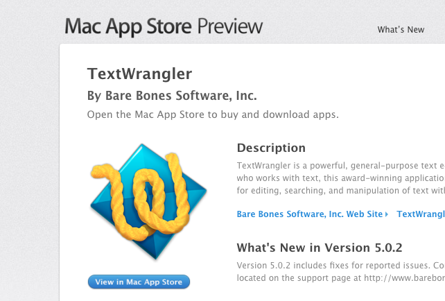
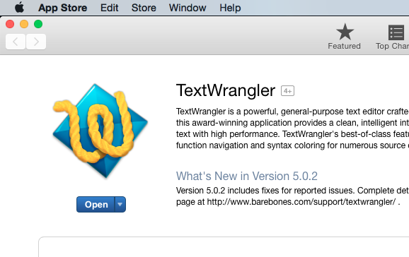
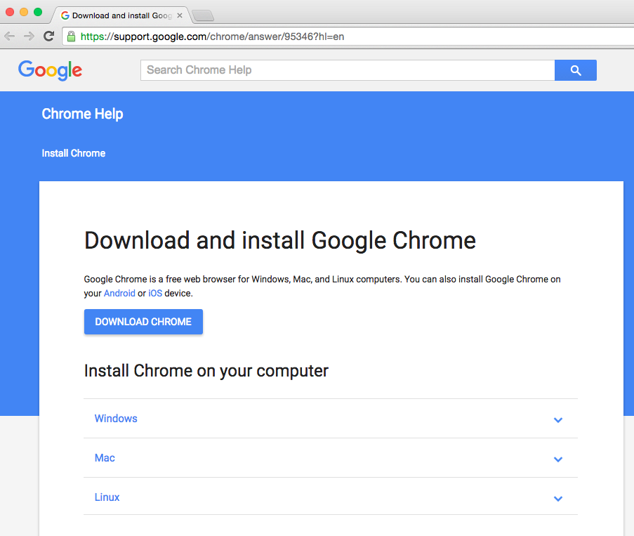
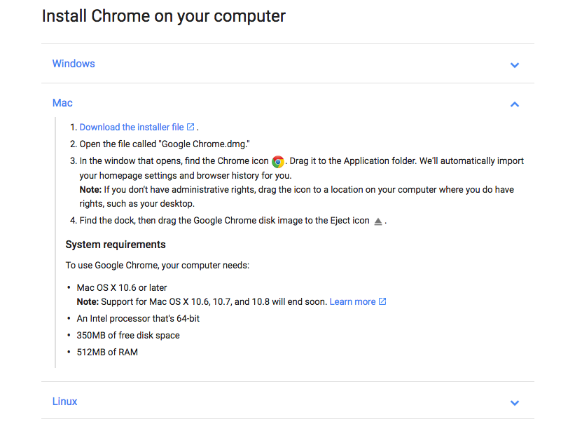

## Day One Installs
#### Overview
We are going to have you install some technologies to make your life easier as a developer, prepare you for the resources you will need during this class, and also make it easier to communicate.  
## Resource List
* You need to be an Admin on your machine.  

#### Slack
*[https://slack.com/][slack]*  
* Slack is a team collaboration tool similar to g-chat or AIM which developer teams can use to share code snippets, and communicate with teams.
* Signup: create an account on Slack and join the SkillDistillery team
* Download: The Mac Slack application is really convenient and easy to use (vastly superior to the browser interface), you can download it here: [https://slack.com/downloads][slackdown]  

#### Keyboard Repeat
*This one is a system preference setting*  
* The speed at which your keys wait to repeat can have a surprising effect on your productivity. We recommend that you reduce the time between repeat as much as possible.
* Open spotlight (command + spacebar) and goto 'System Preferences'
    * Click on 'keyboard'
    * Under 'Key Repeat' move the slider to 'Fast'
    * Under 'Delay Until Repeat' move the slider all the way to 'Short'  
  
#### Git
*[http://git-scm.com/download/mac][gitdown]*  
* Git is version control software that we will start using later this week and througout the program
* Follow the install instruction on the link above  

#### Github
*[https://github.com/][gh]*  
* Github is a collaboration/social tool for developers which we will be using to share resources and code throughout the program
* Github will also be a good place for you to display your work to employers down the road, so we are going to make fairly extensive use of it.  

#### Github Pages
*[https://pages.github.com/][pages]*  
* Github pages will be a quick way for us to establish a web presence and start blogging.
* Follow the steps on the link above and use your handy new Github profile to get started.
* Do you know any HTML? Get some practice by playing around with this page.  
  
####Java Path Configuration  
* We need to let your local environment know where to find Java so that the Java Virtual Machine (JVM) can know how to load compiled classes. We do this by updating your CLASSPATH.
* First lets add a JAVA_HOME export to your bash profile.
    * Open your .bash_profile with your handy new alias:
    ```bash
    tw ~/.bash_profile
    ```
    * In here on a new line, add:
    ```bash
    export JAVA_HOME=/Library/Java/JavaVirtualMachines/jdk1.8.0_60.jdk/Contents/Home
    ```
    * Now copy that same line and paste it into terminal and hit return.
    * Let's check to make sure that Java is now in our PATH:
    ```bash
    which java
    #/Library/Java/JavaVirtualMachines/jdk1.8.0_60.jdk/Contents/Home/bin/java
    
    echo $PATH
    #/Library/Java/JavaVirtualMachines/jdk1.8.0_60.jdk/Contents/Home/bin
    ```  
  
####Text Wrangler
*[https://itunes.apple.com/us/app/textwrangler/id404010395?mt=12][wrangler]*  
* If you do not already have a text editor that you prefer, we recommend downloading TextWrangler to use during Quad 1. You can click on the link above and then click the "View in Mac App Store" button, or open your App Store application and search for "TextWrangler"
  
* Once you are in the App Store, click the 'Get' button below the image, and then click "Install App"  
  
* Now click the 'Open' button, it should open TextWrangler  

#####Bonus!
* Now we are going to do something cool. We are going to create an alias to open TextWrangler from the command line. WHY? Because it's going to speed us up. The less we go to finder to open/save a document the better.
* Open a terminal
    * Change directory to your desktop `cd Desktop`
    * Use this crazy verbose command to create and open a file called 'test.html' in TextWrangler
        * First let's create the file with `touch test.html`
        * `open -a /Applications/TextWrangler.app/ test.html`
    * Cool right? But that syntax is terrible. Let's fix that.
    Back in terminal we are going to open our '.bashrc' file. This is a hidden file that helps us configure our environment settings.
        * `open -a /Applications/TextWrangler.app/ ~/.bashrc`
* Now that we have our bashrc file open we can make our lives easier by creating an alias for TextWrangler.
```bash
# Use 'tw' on the terminal to open TextWrangler
alias tw='open -a /Applications/TextWrangler.app'
```
* The code above tells our terminal to interpret `tw` the same way as it would `open -a /Applications/TextWrangler.app` ... it's a little bit more convenient.
* Now save your updated bashrc (command + s), and then close this window of TextWrangler (command + w).
* Let's make sure it worked. Go back to your terminal and quit (command + q), we need to completely quit our current terminal session in order for our changes to take effect.
* Open a new terminal window, navigate to desktop `cd Desktop` and now let's try `tw test.html`    
  
####Chrome
*[https://support.google.com/chrome/answer/95346?hl=en][chrome]*  
* Due to browser inconsistencies it will be helpful for all of us to be on the same client. For various reasons (dev tools and google cast included) we have chosen Google Chrome. If you do not already have Google Chrome installed, click the link above and use the Mac install instructions.  
  
  

####Google Cast
*[https://chrome.google.com/webstore/detail/google-cast/boadgeojelhgndaghljhdicfkmllpafd?hl=en][cast]*  
  
* In order to do code reviews and presentations (or really just share your screen for any old reason), we are going to be using Google Cast.
* To install this Chrome Extension, open Google Chrome, and go to the link above. Then Click the blue "Add Extension" button on the pane and the extension will be added to your browser.


[slack]:https://slack.com/
[slackdown]:https://slack.com/downloads
[gitdown]:http://git-scm.com/download/mac
[gh]:https://github.com/
[pages]:https://pages.github.com/
[chrome]:https://support.google.com/chrome/answer/95346?hl=en
[wrangler]:https://itunes.apple.com/us/app/textwrangler/id404010395?mt=12
[cast]:https://chrome.google.com/webstore/detail/google-cast/boadgeojelhgndaghljhdicfkmllpafd?hl=en
